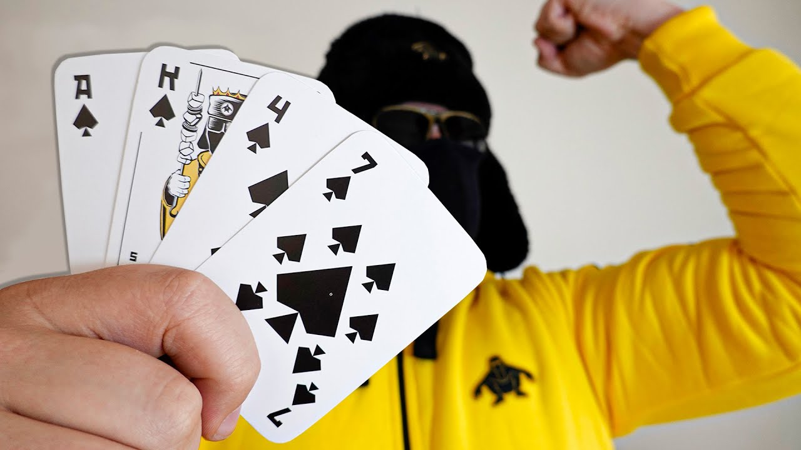

# Kalashnikov
An implementation of [Kahashnikov](https://www.youtube.com/watch?v=IiRk-yGfAjc) from [Life Of Boris](https://www.youtube.com/user/NocturnoPlays).

## Execution
Use the following command to build the program.

``gradlew build``

Use the following command to run the program.

``gradlew run``

## Rules
* Standard card deck
* Each person has 20 health
* Four cards to each person
    * Rest is military garbage pile
* Need `ace`, `4`, `king`, and `7` to spell out `AK-47`
* Shelf space is shared by both players
    * Not visible to either
* Put one card in the discard pile or shelf
    * Draw one card from military garbage pile
* Strength of cards: A-K-Q-J-10-9-8-7-6-5-4-3-2
* One who made gun picks one of enemy's cards
* Damage is done based on choice of card:
    * Weakest card:
        * 1 damage
    * 2nd weakest card
        2 damage
    * etc.
    * Damage is equal for same num, different suit
* Collect and shuffle cards again
